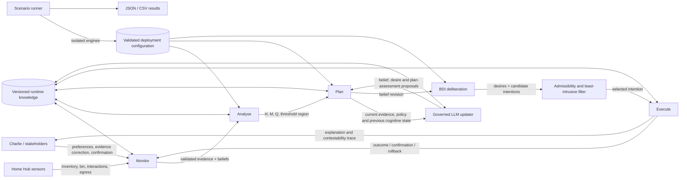

# EASE MVP architecture

## Publication figure

The vector architecture figure used by the paper is available at
[`docs/figures/ease-mvp-architecture.pdf`](figures/ease-mvp-architecture.pdf).
The corresponding executable-scenario comparison is available at
[`docs/figures/ease-mvp-scenario-comparison.pdf`](figures/ease-mvp-scenario-comparison.pdf).
It is generated from the versioned source script rather than edited manually:

```bash
python3 -m pip install reportlab
python3 scripts/generate_ease_paper_figures.py \
  --output-dir docs/figures \
  --figure architecture
```

The script can also generate the scenario comparison figure after a batch
result is available under `output/batch/`; run it with `--figure scenario` or
omit `--figure` to generate both paper figures.

## Runtime organisation



`mapek/MapeKLoop` implements the outer MAPE-K governance cycle. After deterministic monitoring and mismatch analysis, `llm/update/LlmKnowledgeBdiUpdater` can produce a structured, inspectable cognitive update from the current and previous Knowledge state. During `Plan`, `mapek/plan/AutonomyPlanner` invokes the components under `bdi/` for belief-aware desire generation, authorised candidate-intention construction, filtering, and selection. `mapek/knowledge/RuntimeKnowledgeBase` stores the resulting cognitive update and trace. `runtime/EaseEngine` is the facade that wires these components and exposes use cases to the web, single-run CLI and batch runner. `configuration/DeploymentConfiguration` is the single validated source for evaluator parameters, policy, plans and BDI defaults. `scenario/ScenarioRunner` creates an isolated engine per scenario and feeds both the comparison table and exports.

## Source packages

```text
org.ease.mvp
├── configuration     DeploymentConfiguration, JSON codec, bundled/overlay loader
├── mapek
│   ├── monitor       EvidenceMonitor, MonitoringSnapshot
│   ├── analyse       EthicalAnalyser, MismatchIndicator, GovernanceState
│   ├── plan          AutonomyPlanner, PlanningResult
│   ├── execute       IntentionExecutor, ExecutionRecord
│   └── knowledge     RuntimeKnowledgeBase, DecisionTrace, Contestation
├── bdi
│   ├── belief        BeliefRevision, BeliefBase
│   ├── desire        DesireGenerator, DesireSet
│   ├── intention     HomeHubPlanLibrary, CandidateIntention
│   └── deliberation  BdiDeliberator, DeliberationResult
├── llm
│   ├── config         LlmSettings, LlmApiProtocol
│   ├── client         LlmClient, OpenAiCompatibleLlmClient
│   ├── model          LlmCognitiveUpdate, CognitiveAssertion, LlmPlanAssessment
│   ├── runtime        LlmRuntime
│   └── update         LlmKnowledgeBdiUpdater
├── homehub           HomeHubConfiguration
├── domain            Evidence, constraints, stakeholders, thresholds, modes
├── runtime           EaseEngine facade
├── scenario          isolated batch execution, result schemas and CSV export
├── app               HTTP server, single-scenario CLI and batch CLI
└── support           JSON serialisation
```

## Mapping Algorithm 1 to the MVP

| Paper step | MVP realisation |
|---|---|
| 1. Update evidence and beliefs | `monitor/EvidenceMonitor` and `bdi/belief/BeliefRevision` |
| 2. Instantiate constraints | `homehub/HomeHubConfiguration` provides versioned `Cprivacy`, `Csustainability`, and `Cautonomy` |
| 3. Compute indicators | `analyse/EthicalAnalyser`, with separate `d`, `s`, `m`, `q`, and evidence links |
| 4. Aggregate governance | `analyse/EthicalAnalyser`; hard constraints remain outside the compensatory soft score |
| 5. Determine region | Versioned policy `T1` and explicit low-confidence review path |
| 6. Generate desires | `bdi/desire/DesireGenerator`, including the hard-violation objective when applicable |
| 7. Generate intentions | `bdi/intention/HomeHubPlanLibrary`: `I1`-`I4`, plus `I5` and `I0` |
| 8. Filter intentions | `bdi/deliberation/BdiDeliberator`: consent, hard-constraint, and mode checks |
| 9. Evaluate intentions | `BdiDeliberator`: residual mismatch, confidence, cost, burden, and reversibility |
| 10. Least-intrusive selection | `BdiDeliberator`: intrusion rank, sufficiency, residual mismatch, and burden |
| 11. No admissible intention | Safe-mode retention and `HUMAN_REVIEW_REQUIRED` |
| 12. Commit and execute | `mapek/execute/IntentionExecutor` handles immediate execution, confirmation, and rollback |
| 13. Produce trace | `mapek/knowledge/DecisionTrace` exposes every field required by Table 2 |
| 14. Observe feedback | `ExecutionRecord`, autonomy-mode update, and knowledge-version increment |
| 15. Contest and revise | `RuntimeKnowledgeBase` plus `Contestation`, linked recomputation, and rollback |

The optional LLM updater refines the artefacts used by steps 1, 6, 7, and 9. It does not replace steps 2-5, 8, 10-12, or 15: constraint activation, mismatch computation, governance regions, admissibility, least-intrusive selection, confirmation, execution, and contestation remain deterministic.

## Runtime ethical state

Each `EthicalConstraint` contains:

- hard/soft kind;
- originating stakeholder and source of authority;
- target and contextual applicability;
- precedence and weight;
- contestability status;
- violation handling;
- revision policy;
- version.

The reference deployment includes four explicit stakeholders: Charlie, the household, the Home Hub operator, and the regulator. Deployments, policies and plan values are loaded from validated JSON rather than declared independently in UI or CLI code.

## Domain mapping for the Home Hub

The paper stipulates `m_sustainability(t)=0.62` for the worked trace but intentionally leaves the domain-specific functions `d_i(t)` and `s_i(t)` open. This MVP makes one such mapping executable and visible:

```text
wasteRatio = discardedPerishables / purchasedPerishables
ignoredRatio = ignoredSuggestions / advisorySuggestions

d_sustainability = clamp(
  (wasteRatio - targetWasteRatio)
  / (fullDeviationWasteRatio - targetWasteRatio)
)

s_sustainability = clamp(ignoredRatio)
# If no suggestion history exists, use clamp(wasteRatio / fullDeviationWasteRatio)
m_sustainability = d_sustainability * s_sustainability
```

The illustrative deployment values are:

```text
targetWasteRatio = 0.10
fullDeviationWasteRatio = 0.2935483871
```

For the paper evidence, `d=0.775`, `s=0.8`, and `m=0.62`. The `fullDeviationWasteRatio` value is a transparent demo calibration chosen to instantiate the paper's stipulated mismatch. It is not claimed to be empirically or normatively valid.

Soft mismatches and confidence are then aggregated independently:

```text
M(t) = (0.65 * m_sustainability + 0.35 * m_autonomy) / 1.0
Q(t) = (0.65 * q_sustainability + 0.35 * q_autonomy) / 1.0
```

This produces `M(t)=0.403` and `Q(t)=0.935`. Confidence is not used to suppress the mismatch, following the paper.

## Governance policy

Policy `T1` is versioned and owned by the Home Hub operator:

```text
tauA  = 0.20
tauAS = 0.35
tauD  = 0.65
tauR  = 0.85
qmin  = 0.80
```

Thresholds limit which autonomy modes may enter automatic selection; they do not directly choose a mode. If `Q(t) < qmin`, the engine retains the current safe mode and requests authorised human review.

Hard violations are evaluated lexicographically. An unauthorised external disclosure activates `Cprivacy`; food-waste candidates cannot compensate for it, and `I5` blocks transmission in restrictive mode.

## BDI-style deliberation

The engine records:

- **beliefs**: evidence, context, current mode, consent, and hard-violation state;
- **desires**: active, ethically admissible objectives;
- **intentions**: executable plans paired with autonomy modes and predicted outcomes.

Candidate intentions are kept in the trace even when rejected. For the worked scenario, `I2` wins because it is the lowest-rank admissible candidate predicted to reduce residual mismatch below `tauAS`. It is not enacted until Charlie confirms.

## Governed LLM update path

The updater uses a strict schema and produces only proposals. It can add confidence-qualified and contestable belief/desire assertions and reassess predicted outcomes for the finite plan templates `I1`-`I4`. Plan identity, actuator semantics, autonomy mode, confirmation requirement, reversibility, and baseline cost/burden remain owned by `HomeHubPlanLibrary`.

Before a provider-derived assessment can affect selection:

1. explicit consent to transmit runtime evidence must be active;
2. an active `Cprivacy` hard violation prevents the provider call entirely;
3. its JSON shape, identifiers, lengths, and numeric ranges are validated;
4. prediction confidence is capped by the aggregate evidence confidence `Q(t)`;
5. candidates below `qmin` are rejected;
6. hard constraints, consent and governance-region checks are applied;
7. the ordinary least-intrusive comparator selects among the remaining sufficient candidates.

Each considered update is appended to Knowledge with status `APPLIED_AS_GOVERNED_PROPOSAL`, `FAILED_LOCAL_FALLBACK`, `DISABLED_LOCAL_BASELINE`, `SKIPPED_NO_LLM_DATA_CONSENT`, or `SKIPPED_HARD_PRIVACY_CONSTRAINT`, along with the public endpoint, protocol, model, provider request identifier, latency, token usage, proposals, and uncertainty. The API key is never part of this model.

## Contestability and audit semantics

Decision traces are append-only for the lifetime of the process. A correction never overwrites the source trace. A `HISTORICAL_FACT_CORRECTION` creates a new `REVISION_AFTER_CONTESTATION` trace that records:

- the challenged field and reason;
- previous and corrected values;
- the original trace identifier;
- the recomputed indicators and governance tuple;
- the new candidates and selected intention;
- any executed rollback.

Correcting discarded perishables from 3 to 1 moves `M(t)` from `0.403` to `0`. If assistive mode was only proposed, the proposal is withdrawn. If it was already confirmed and executed, `I0` rolls the system back to advisory mode.

A `PROSPECTIVE_CONSENT_CHANGE` produces a separately labelled trace. It may
change external-disclosure consent and/or automatic-list-change consent for the
new cycle, but it retains the source event's historical facts. This prevents
retroactive authorisation while allowing subsequent deliberation to use the
new consent state.

## Batch execution boundary

`ScenarioRunner` is shared by the dashboard and `BatchCli`. It materialises and
validates each configuration, creates an isolated `EaseEngine`, applies optional
evidence overrides and optional contestation, and converts the trace into a
stable `ScenarioResult`. Exceptions are caught at the scenario boundary, so
one malformed scenario becomes an error row without aborting the batch.

The browser uses `BatchJobManager` only for asynchronous progress reporting.
It does not contain calculation logic. `ScenarioCsvExporter` and the JSON
serializer consume the same result objects displayed by the comparison table.
