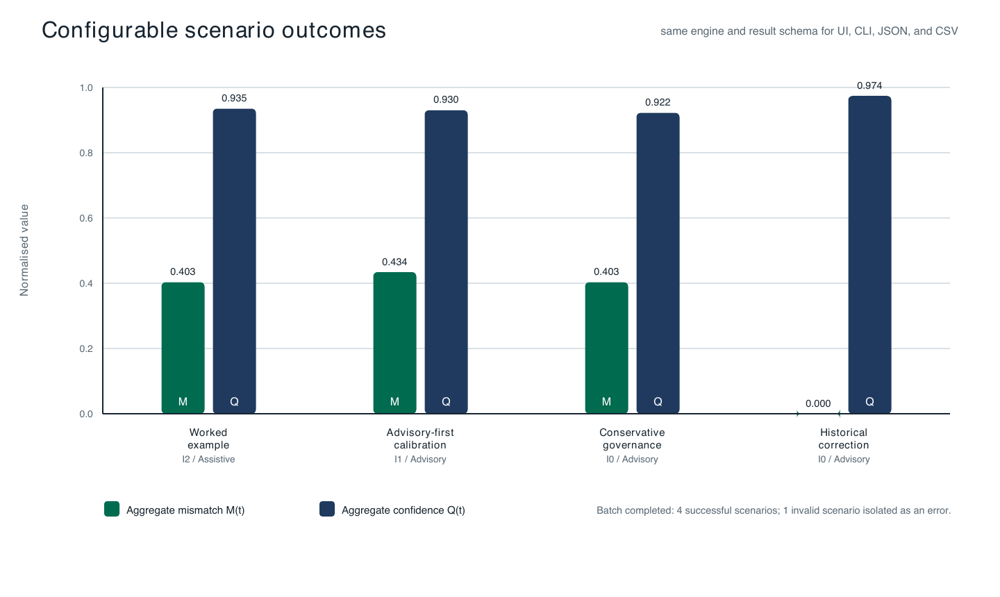

# EASE MVP validation report

This report summarises the executable validation evidence supplied with the
EASE MVP. It is intended to help reviewers reproduce the worked example,
inspect the behaviour of configurable scenarios, and understand the boundary
between implementation evidence and empirical evaluation.

## Validation scope

The validation establishes that the implementation:

- reproduces the numerical trace and plan selection reported for the paper's
  Charlie/Home Hub worked example;
- applies the same validated configuration and application logic through the
  dashboard, single-run CLI, and batch runner;
- preserves original and corrected evidence during contestation and recomputes
  dependent governance and BDI artefacts;
- isolates invalid scenarios instead of aborting a batch;
- exports JSON and CSV values consistent with the comparison table; and
- keeps the optional LLM connector governed, consent-gated, and free of API-key
  leakage in state, traces, logs, and exports.

These checks validate an executable research artefact. They are not an
empirical evaluation of users, deployed sensors, policy calibration, or the
normative suitability of the illustrative parameters.

## Reproduction

Requirements are JDK 21 and a POSIX-compatible shell. From the repository root:

```bash
./scripts/test.sh
./scripts/batch.sh
```

The first command compiles the project and runs the complete dependency-free
test suite. The second executes the bundled `ease-scenario-batch/v1` document
and writes timestamped aggregate results under the ignored `output/batch/`
directory.

## Automated verification result

The following results were reproduced on 31 July 2026 using the versioned
default configuration and scripts:

| Check | Result | Reproducible evidence |
|---|---:|---|
| Automated test suite | **PASS: 20/20** | `./scripts/test.sh` |
| Worked-example regression | **PASS** | `M(t)=0.403`, `Q(t)=0.935`, `I2`, `ASSISTIVE`, confirmation pending |
| Bundled scenario batch | **4 success, 1 expected error** | `./scripts/batch.sh` |
| Per-scenario error isolation | **PASS** | The deliberately invalid fifth scenario is recorded as `ERROR`; the other four complete |
| JSON/CSV/table consistency | **PASS** | Integration test compares stable exported fields with scenario results |
| Configuration validation | **PASS** | Missing, incompatible, and out-of-range inputs are rejected before execution |
| Contestation traceability | **PASS** | Source trace and revision trace retain original and corrected values |
| LLM secret and consent controls | **PASS** | HTTP contract, consent gate, privacy gate, fallback, and API-key redaction tests |

## Scenario comparison

The bundled batch contains the reference deployment, two configuration
variations, a historical correction, and one intentionally invalid scenario.
The scenarios are sensitivity demonstrations, not measurements or calibrated
policy recommendations.

| Scenario | Principal variation | Confidence | Discarded | `M(t)` | `Q(t)` | Final result | Execution |
|---|---|---:|---:|---:|---:|---|---|
| Worked example | Reference configuration | `0.90` | `3` | `0.403` | `0.935` | `I2` / `ASSISTIVE` | `PENDING_CONFIRMATION` |
| Advisory-first plan calibration | Weights and `I1` outcomes changed | `0.90` | `3` | `0.434` | `0.930` | `I1` / `ADVISORY` | `EXECUTED` |
| Conservative threshold policy | Higher governance thresholds; lower input confidence | `0.88` | `3` | `0.403` | `0.922` | `I0` / `ADVISORY` | `MONITORING` |
| Historical evidence correction | Confidence `0.90 -> 0.96`; discarded `3 -> 1` | `0.96` | `1` | `0.000` | `0.974` | `I0` / `ADVISORY` | `MONITORING` |
| Invalid input | Discarded count exceeds purchased count | — | — | — | — | `NOT_EXECUTED` | `ERROR` (isolated) |

The reference trace confirms the paper's decision chain: the sustainability
mismatch is `0.620`; weighted aggregation produces `M(t)=0.403`; the aggregate
confidence is `Q(t)=0.935`; and `I2` is the least-intrusive admissible plan that
is predicted to reduce residual mismatch below the configured threshold. Its
mode change remains subject to Charlie's explicit confirmation.

[](figures/ease-mvp-scenario-comparison.pdf)

The vector version is available as
[`ease-mvp-scenario-comparison.pdf`](figures/ease-mvp-scenario-comparison.pdf).
The figure can be regenerated from a batch result with
`scripts/generate_ease_paper_figures.py`.

## Stable result schemas

The batch JSON document uses `ease-scenario-batch-result/v1`; each CSV record
uses `ease-scenario-csv/v1`. Both include scenario identity, materialised
parameters, thresholds, weights, plans, original and corrected evidence,
confidence, consensus/governance values, discarded-product counts, final plan
and mode, metrics, status, errors, notes, and execution timestamp. Field-level
documentation is in
[`CONFIGURATION.md`](CONFIGURATION.md#result-and-export-schemas).

Timestamped outputs are deliberately not committed: they are generated evidence
whose contents and creation times are reproducible through the commands above.

## Evidence boundary and limitations

The current artefact provides deterministic functional, integration, contract,
and regression evidence. It does not yet establish field reliability, latency
or throughput at production scale, longitudinal user acceptance, cross-domain
generalisability, or empirical calibration of ethical weights and thresholds.
The Home Hub parameters instantiate the paper's worked trace transparently and
are replaceable through validated configuration.

Operational assumptions, trust boundaries, failure behaviour, and remaining
production-hardening work are documented in
[`OPERATIONAL_LIMITATIONS.md`](OPERATIONAL_LIMITATIONS.md). The component and
data-flow mapping is documented in [`ARCHITECTURE.md`](ARCHITECTURE.md).
